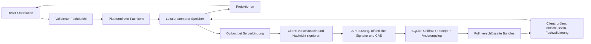

# Technische Architektur

## Bestand und bestätigter Zielzustand

Die folgende Komponentenstruktur beschreibt die vorhandene TypeScript-/React-Grundlage und die bisherigen P1–P11-Verträge. Das am 8. Oktober 2026 bestätigte [Portabilitätskonzept](core-and-sql-portability.md) und ADR-042–ADR-044 in den [Entscheidungen](decisions.md) legen den künftigen Rust-Fachkern, UI-freie Anwendung und SQL-Serveradapter fest. Bei Aussagen zu TypeScript-Fachberechnung, UI-Composition und ausschließlichem SQLite-Serverbetrieb gelten diese bisherigen Festlegungen nur für Bestand und Übergang bis zur jeweiligen K-Abnahme. Der Auftrag umfasst ausschließlich Dokumentation und Issueanlage.

## Komponenten und bisherige Struktur

| Bereich | Verantwortung | Darf abhängen von |
| --- | --- | --- |
| packages/domain | Geld, Datum, Regeln, Budget, Ausgleich; pure Validatoren und Änderungsberechnung | Plattformfreie Vertragstypen |
| packages/contracts | Validierte Ein-/Ausgaben, Fehlertypen und Versionen | Plattformfreie Schema-Bibliothek |
| packages/crypto | Clientseitige Verschlüsselung, Tresor, Signaturen, KeyGrants | contracts, gepflegte libsodium-Bindung; keine Serverprivatschlüssel |
| packages/storage | Adapter, Transaktionen, Projektionen, Migrationen | domain, contracts |
| packages/sync | Verschlüsselte Outbox, Push/Pull, Revisionen, Konflikte | domain, contracts, crypto, Storage-Port |
| packages/importers | Dateiparser, Normalisierung, Vorschau, Dubletten | domain, contracts |
| packages/ui | Client-Composition, Fachkomponenten, Plattformtokens, Eingabe- und Ansichtsmuster | domain/contract-Typen, React, crypto/storage/importers; native Funktionen weiterhin als Plattformport |
| apps/web | PWA, Browserrouting, Service Worker, IndexedDB-Komposition | gemeinsame Pakete |
| apps/desktop | Tauri-Hülle, gemeinsame React-App, Rust-Speicher-/Systembrücke | gemeinsame Pakete; begrenzte Tauri-Commands |
| apps/server | Fastify, Identitäten, öffentliche Rechte/Zertifikate, SQLite-Chiffratspeicher und PWA | öffentliche contracts, Signaturprüfung und servergeeignete Speicherteile; kein Finanzfachkern |

Keine UI-Abhängigkeiten im Fachkern; Contracts importieren nicht domain. Die gemeinsame UI-Schicht bildet den Client-Composition-Root und darf dafür die lokalen Crypto-/Storage-/Importclients verwenden; native Datei-, Menü-, Link- und Tokenfunktionen bleiben als `PlatformServices` injiziert. Der Server kann Finanzinhalte wegen verpflichtender E2EE nicht validieren oder berechnen. Apps gelten nach Authentifizierung als vertrauenswürdige Clients; keine Codesignatur/Attestierung als Zugangsvoraussetzung. Nachrichten-/Schlüsselsignaturen sind davon getrennte Integritätsprüfungen.

## Bibliotheken und Toolchain

pnpm-Workspace, TypeScript strict, React, Vite, Tauri 2, Fastify, Dexie, Zod für Verträge, gepflegte libsodium-WASM-Bindung, RFC-8785-Kanonisierung, Vitest und Playwright. SQLite im Server mit einem gepflegten Node-Binding; Desktop über Rust/SQLite. In P1 kompatible stabile Versionen und eine unterstützte Node-LTS-Version festlegen und exakt sperren. Keine beta-Abhängigkeiten als Default. Cryptoverträge stehen in [Verschlüsselung](encryption.md).

Routing und UI-Zustand bleiben von persistenten Fachdaten getrennt. Kontolisten werden virtualisiert; große Imports und Berichtsprojektionen laufen im Web Worker. Lucide liefert Werkzeugicons, Systemschriften die Typografie. Native Funktionen werden über `PlatformServices` injiziert, nicht durch Plattformprüfungen in jedem Fachwidget.

## Speicherports

`StorageAdapter` bietet `readAggregate`, `query`, `applyAtomicBatch`, `loadConfirmed`, `loadPending`, `saveSyncPage`, `exportSnapshot`, `replaceSnapshot` und `rebuildProjections`. `applyAtomicBatch` prüft erwartete lokale Revisionen und schreibt Aggregate, Outbox und Projektionen gemeinsam. `saveSyncPage` schreibt alle Seitenänderungen samt Folgekursor in einer Transaktion.

Der lokale Port ergänzt `initializeArea(spaceId, proposedEpoch)` für die atomare, idempotente Epochengrundlage gemäß [ADR-040](decisions.md#adr-040--dauerhafte-lokale-epoche-ohne-synczustand). Diese Metadaten benötigen weder Serveranmeldung noch Cursor oder Outbox und bleiben von den Finanzaggregaten getrennt.

Snapshotersatz verwendet vor jeder Mutation die gemeinsame Form-/Kontextprüfung und den vollständigen Fachvalidator gemäß [ADR-041](decisions.md#adr-041--gemeinsame-snapshotprüfung-vor-destruktivem-ersatz). Finanzregeln bleiben im TypeScript-Fachkern; native SQLite-Kommandos prüfen zusätzlich Metadatenbindung und fremde Handlebelegungen innerhalb der Transaktion.

IndexedDB und SQLite auf Clients erfüllen dieselbe Fachspeicher-Contract-Suite. Die Desktopbrücke akzeptiert katalogisierte Batchtypen; die UI erhält keinen unbeschränkten SQL-/Dateizugriff. Der Server besitzt einen separaten CiphertextStore: opake Handles/Revisionen, verschlüsselte Bundles, öffentliche Manifeste, Receipts und Changes. Er committet diese atomar, niemals Finanzaggregate/Projektionen im Klartext.

## Datenfluss

Der Lokalbetrieb durchläuft denselben Clientfachkern, benötigt aber keine Outbox. Serverbestätigung bedeutet Speicherung einer gültigen verschlüsselten Hülle, nicht serverseitige Bestätigung von Geldberechnungen. Empfänger validieren Inhalte vor Anwendung. Der UI-Erfolg eines Schreibvorgangs bedeutet dauerhafte lokale Speicherung, nicht bereits abgeschlossene Serversynchronisierung.

## Lokaler und verbundener Betrieb

Der Desktopstart benötigt keine Netzwerkverbindung. Die PWA cached ausschließlich versionierte App-Assets, niemals API-Antworten im Service Worker. Nach Erstladen ist sie offline startfähig. Persistenter Browserspeicher wird angefragt; Ablehnung oder Quota-Fehler werden sichtbar und verhindern keine Exporte bestehender Daten.

Ein eigenständiges lokales Profil besitzt einen privaten Bereich und beliebig viele Haushalte mit fachlichen Teilnehmern; es ist kein Benutzerkonto und kein Mehrbenutzer-Sicherheitsmodell. Für reine lokale Nutzung gibt es weder Anmeldung noch Benutzerverwaltung. Erst beim Serververbinden authentifiziert sich das Profil über den konfigurierten externen OIDC- oder vergleichbaren Identitätsanbieter. Verbundene Profile werden nach Serverinstanz und externer Subject-ID getrennt; mehrere Browser-Tabs koordinieren Schreib-/Syncführung über Web Locks/BroadcastChannel. Abmeldung löscht Server-Sitzungsmaterial und sperrt verbundene Bereiche; lokale Daten bleiben auf ausdrücklichen Wunsch für eine spätere Verbindung erhalten.

Ein lokaler Bereich wird nach bestätigter Rettungscodesicherung über `spaces/from-snapshot` als verschlüsselter, signierter Snapshot servergebunden. Ein leerer privater Initialbereich kann ausdrücklich übernommen werden; vorhandene Finanzdaten verlangen bestätigten Restore mit Backup. Teilnehmer bleiben zunächst ungebundene Personen; Familienbeitritt benötigt zusätzlich bestätigte KeyGrants. Nutzerexporte sind eigenständig verschlüsselt; ihre Schlüssel und Serverbindung verleihen keine Mitgliedschaft.

## Plattformintegration

Desktop verwendet originale Fensterdekoration, Systemmenüs, Dateiöffnen/-speichern, Betriebssystem-Schlüsselspeicher und bekannte Tastenkürzel. Native Datendialoge sind auf Web/PWA durch Browserdateiauswahl ersetzt. `PlatformServices` abstrahiert Dateiimport, Export, externe Links, Menübefehle, Datenpfad und sichere Tokenspeicherung. `onMenuCommand` liefert ein abmeldbares Ereignisabonnement; `setMenuCommands` aktualisiert die Erreichbarkeit der Finanzaktionen. In P4.5 zeigt die begrenzte Rust-Dateibrücke selbst Öffnen/Speichern und verarbeitet ausschließlich bestätigte Dateien, ohne einen frei übergebenen Dateipfad zu akzeptieren. Die spätere Import-/Exportfachlogik bleibt P5/P10.

Tauri lädt nur gebündelte Inhalte. Netzwerkanfragen gehen über eine begrenzte native Transportbrücke zur ausdrücklich konfigurierten HTTPS-Serverorigin; keine Tokens im React-Speicher persistieren. Bei localhost ist HTTP für Entwicklung zulässig. SQLite-Schreibbatch und Konsistenzprüfung erfolgen in Rust atomar; Fachberechnungen bleiben TypeScript.

## Skalierung und Kompatibilität

Eine Serverinstanz mit SQLite und lokalem dauerhaftem Volume ist v1-Betriebsmodell. Schreibzugriffe werden serialisiert, Leseseiten paginiert. Kein Cluster, kein Netzwerkdateisystem und keine externe Queue. SQL-Schema und finanzielle Snapshots werden durch Integrationstests mit 50.000 Buchungen geprüft.

Protokollversion 1 akzeptiert bekannte verschlüsselte Hüllen/Cryptosuites; Fachbefehle/-schemas prüfen ausschließlich Clients. Inkompatible Clients bekommen `UPDATE_REQUIRED`. Service-Worker-Updates werden angeboten, nicht während eines Imports/Dialoges erzwungen. Vor Storage-Migration wird verschlüsselt gesichert. Serverherabstufung nur durch passendes Betreiberbackup mit clientbestätigtem Wiederanlauf.

## Quellen und Lizenz

Projektlizenz: AGPL-3.0-or-later. Fremdcode wird mit Herkunftscommit und ursprünglichem Hinweis dokumentiert. Fundamentale Architekturgrundlagen: [SQLite-Transaktionen](https://www.sqlite.org/lang_transaction.html), [Dexie](https://dexie.org/docs/Dexie/Dexie), [Tauri](https://v2.tauri.app/security/capabilities/), [Fastify-Validierung](https://fastify.dev/docs/latest/Reference/Validation-and-Serialization/).
