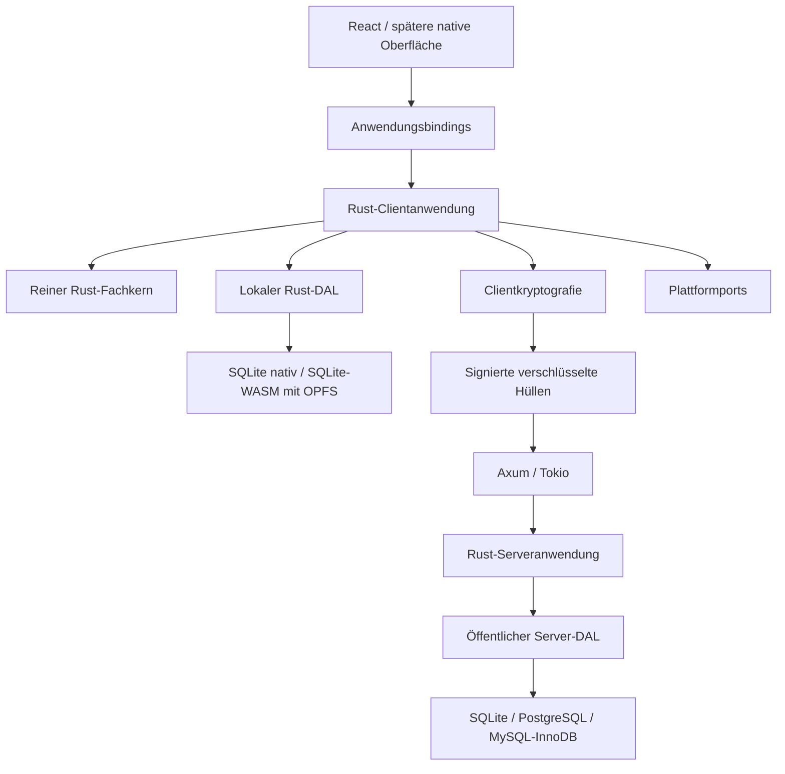

# Technische Architektur

Stand: 9. Oktober 2026. Verbindliches Ziel gemäß ausdrücklich bestätigtem Architekturauftrag: gemeinsamer Rust-Fachkern, Rust-Clientanwendung, lokaler Rust-DAL nativ/WASM und eigenständiger Rust-Server. [Review und Begründungen](architecture-review.md), [aktive Entscheidungen](decisions.md), [Auftrag und Freigaben](tasks.md). Die Annahme des Ziels ist keine bereits erfolgte Codeumstellung. GitHub führt den Fortschritt in [Gesamtübersicht #114](https://github.com/mpwg/WiMM/issues/114).

## Bestand und Übergang

Reviewbasis ist `84d730cc6e10d70cf6ac6ff9bc28c4a9c4376e92`. `packages/domain` liefert noch die produktive TypeScript-Engine, `packages/application` UI-freie TypeScript-Controller. K01–K04 sind historische geprüfte Grundlagen; die Rust-Engine liegt in `crates/finance-core`, die Sprachbindungen in `crates/finance-bindings`. Web verwendet Dexie/IndexedDB, Desktop katalogisierte Tauri-Kommandos mit rusqlite. Fastify enthält nur Health-/Metadatenrouten. `packages/sync` ist noch ohne produktive Syncimplementierung. [Belegindex](review-evidence.md) nennt tatsächlich ausgeführte und fehlende Prüfungen.

Bis zur jeweils geprüften Aktivierung bleibt der vorhandene Adapter maßgeblich. IndexedDB ist Migrationsquelle und Übergangsadapter, kein zusätzlicher dauerhafter Zielbackend. Ein gescheiterter Diesel-/VFS-Nachweis erfordert eine neue Entscheidung; er erlaubt keine stillschweigende Ersatzarchitektur. React/PWA, Tauri und die derzeitigen Parser bleiben bestehen; vollständig native Produktoberflächen sind weiterhin spätere eigene Aufträge.

## Komponenten und Abhängigkeiten

Die Namen noch nicht implementierter Crates beschreiben Rollen, keine angeblich vorhandenen Pakete.

| Komponente | Verantwortung | Zulässige Abhängigkeiten |
| --- | --- | --- |
| Rust-Fachverträge | Sichere Geld-/Datums-/ID-/Revisionstypen, Befehle, Ergebnisse, Versionen | Plattformfreie Serialisierung/Schemawerkzeuge |
| Rust-Fachkern | Regeln, vollständige Validierung, Gegenbefehle, reproduzierbare Projektionen | Fachverträge; pure Hilfsbibliotheken |
| Rust-Clientanwendung | Profil/Sitzung, Bereich, Befehle, Historie, Konflikte, Import- und Commitkoordination | Fachkern, Fach-/Anwendungsports, Clientkryptografieports |
| Lokaler Rust-DAL | Aggregate, Bestätigungen, Originalentwürfe, Outbox, Indizes, Caches, Snapshots und Migrationen | Lokale Speicherverträge, technische Persistenzbasis |
| Clientkryptografie | Tresor, Schlüssel, Nachrichten, Grants, Snapshots und Export; libsodium | Gemeinsame Cryptoverträge, gepflegte native/WASM-Bindings |
| Technische Persistenzbasis | ORM-/Schemaoperationen, Verbindungsbesitz, Migrationjournal, strukturierte Fehler | Diesel und etablierte Schema-DSL, backendinterne Treiber |
| Öffentliche Serververträge | Hüllen, Identitäten, Manifeste, Receipts, Cursor und Servertransaktionen | Öffentliche Typen; keine privaten Fach-/Tresortypen |
| Rust-Serveranwendung | Externe Identität, Sitzung, öffentliche Autorisierung und Chiffratabläufe | Öffentliche Serverports und öffentliche Signaturprüfung |
| Server-Rust-DAL | Chiffrate und öffentliche Verwaltung in gemeinsamen Transaktionen | Öffentliche Serververträge, technische Persistenzbasis |
| HTTP-Hülle | Axum/Tokio, Routen, Limits, Konfiguration, Lifecycle, Assets und Quellcodeangebot | Rust-Serveranwendung; begrenzte technische Laufzeitdienste |
| Bindings/Adapter | Tauri, WASM/Worker, spätere Swift/Kotlin; Uhr, IDs, Dateien, Netzwerk, Schlüsselspeicher | Anwendungsports; jeweilige Plattformbibliotheken |
| Oberflächen | Darstellung, Fokus, Navigation, Formulardrafts und verständliche Meldungen | Generierte Anwendungs-/Ansichtsbindingtypen; injizierte Plattformdienste |

Der Serverabhängigkeitsabschluss enthält weder Finanzkern noch lokalen Finanz-DAL oder private Entschlüsselungsfunktionen. Gemeinsame technische Infrastruktur bedeutet keine gemeinsamen Client-/Serverentities. Öffentliche Typen und öffentliche Signaturprüfung werden unabhängig von privaten Clientmodulen gebaut. ORM-Entities, Verbindungen, SQL und Treiber verlassen den DAL nicht. UI und Server dürfen keine zweite Geldberechnung implementieren.

## Fach- und Anwendungsschnittstellen

[Gemeinsame Verträge](core-contracts.md) trennen Binding-, Fach-, Storage-, Crypto-/Export- und Transportversion von Epoche. Typisierte Rust-Verträge werden Quelle für Sprachtypen/Formschemas; JSON bleibt kompatible Grenze und verlässt den Fachkern intern. ORM-Schema und Fachschema sind verschiedene Modelle. Formvalidierung ersetzt keine Fachvalidierung.

Die Anwendung erhält deterministische IDs/Zeit, Profil-/Speicher-/Kryptoports und Abbruchsignale. Derselbe Rust-Code koordiniert native und WASM-Abläufe. TypeScript bleibt nach geprüfter Umschaltung Darstellungs-/Plattformadapter. Historie speichert sitzungsbezogene Ziele; der Fachkern berechnet Gegenbefehle gegen aktuelle Revisionen, keinen Snapshotrollback.

Native Runtime und Browserworker halten den vollständigen erforderlichen Fachbestand. Die Oberfläche erhält begrenzte Seiten und versionierte Zustandsereignisse. Kein O(N)-Transfer des ganzen Bereichs pro kleiner UI-Aktion als Zielvertrag. Indizierte Ansichtsports begrenzen Darstellung; Mutationen werden trotzdem gegen einen vollständigen konsistenten Fachbestand geprüft. Sichere Summen, Zwischenwerte und Budget-/Ausgleichsberechnungen bleiben ausschließlich im Fachkern, auch bei SQL-Indizes.

## Lokaler Commit und Projektionen

Ein gemeinsamer Commitdienst führt normale Befehle, Imports, Dauerzahlungen und Historie aus: Kontext prüfen → vollständigen aktuellen Bestand lesen → Fachbefehl ausführen → Änderungsmenge/Projektionen/Originalentwurf vorbereiten → atomar speichern → dauerhaftes Ergebnis übernehmen. Standalone erzeugt keine Outbox; verbundener Modus speichert die zugehörige Operation im selben Batch. Profil-, Sitzungsgeneration und Finanzrevision bleiben getrennte Schutzdimensionen.

Lokale Commitidentität bindet Profil, Bereich, Epoche, Operations-ID und unveränderten Inhalt. Receipt, Aggregate, Outbox und Projektionen teilen eine Transaktion. Lokale Receipts sind keine Serverbestätigungen. Derselbe Inhalt unter derselben ID ist idempotent; abweichender Inhalt wird abgewiesen. `committed`, `notCommitted` und `unknown` sind auch lokal unterscheidbar. Bei unklarem Ergebnis zuerst ursprüngliche Operation abfragen; kein blindes Neuanzulegen mit neuer ID. Abbruch nach Commit hebt den Write nicht auf.

Fehlercodes werden strukturiert durch sämtliche Bindings übertragen; Texte sind ausschließlich Darstellung. Projektionen tragen Ausgangsrevision und eigene Projektionsversion. Stale Caches werden kontrolliert neu berechnet, erhaltene Finanzdaten nie still korrigiert. Atomarer Cacheersatz prüft den zugrunde liegenden Bestand. Finanzrevision bleibt lokal und ist weder Syncaggregat noch Undo-Ziel.

## DAL und Migrationen

Diesel ist bevorzugter Kandidat für typisierte Zugriffe und denselben nativen/WASM-Code. SQLite ist lokales Ziel auf Desktop und PWA; PostgreSQL/MySQL sind ausschließlich Serverbackends. Schemaänderungen verwenden eine etablierte Rust-DSL, zunächst SeaQuery prüfen. Die Verbindung von DSL, Diesel, Ausführung, Journal und den realen Backendgarantien ist nachzuweisen. Keine selbstgebaute DbContext-/LINQ-Engine, kein Lazy Loading und kein implizites Objektgraphsave.

Handgeschriebenes SQL ist nur bei belegter technischer ORM-/DSL-Lücke erlaubt: Zweck, fehlende Funktion, betroffene Backends und echte Prüfungen adapterintern dokumentieren, Werte binden. Keine freien SQL-/Dateipfadparameter aus UI/HTTP/Bindings. Eine Rust-DSL garantiert keine atomare DDL in MySQL; Sicherung, Wiederanlauf und Restore müssen backendgerecht nachgewiesen werden.

Jeder Schemawechsel ist nummeriert, registriert und gesichert; Öffnen synchronisiert kein Schema automatisch. IndexedDB→SQLite nutzt konsistenten Ausgangssnapshot, dauerhaft bestätigte verschlüsselte Sicherung, separates Ziel und vollständigen logischen Vergleich. Alle IDs/Revisionen/Tombstones/Bestätigungen/Pending/Originalentwürfe/Epochen/Cursor bleiben erhalten. Quellwrites werden ausgeschlossen oder vor Aktivierung vollständig erkannt. Absturzsichere Aktivierung lässt genau einen Writer zurück. Kein Dual-Write und kein automatischer Rückfall auf veraltete IndexedDB-Daten nach neuen SQLite-Writes. Quelle nicht beim ersten erfolgreichen Start löschen.

Server-SQL-Wechsel ist ein separates Betreiberverfahren für Chiffrate und öffentliche Daten, einschließlich aller sechs gerichteten Wechsel. Betreiberrestore stellt keine neuen autorisierten Finanzepochen her: Sitzungen widerrufen, Wiederanlauf sperren und clientbestätigte neue signierte Snapshots verlangen.

## PWA-Runtime und Updates

Diesel-WASM-Build allein genügt nicht. Die konkret verwendete SQLite-Instanz muss über einen persistenten Browser-VFS, vorzugsweise OPFS, arbeiten. Worker-/Verbindungsbesitz, Web-Lock-Führung, Mehrtabbetrieb, Führungsverlust und Wiederanlauf werden zusammen nachgewiesen. Ein begrenzter Besitzer führt DB-Zugriffe; wartende Tabs zeigen einen verständlichen Status. Keine konkurrierenden unkoordinierten Writer, keine unbemerkte Memory-/IndexedDB-Ersatzpersistenz.

COOP/COEP-/SharedArrayBuffer-Anforderungen sind VFS-abhängig und Teil des Hosting-/OIDC-Nachweises. Browser-/iOS-Eignung, Quota, Persistenzablehnung und Ressourcenfehler bleiben eigene reale Kriterien. Bei fehlender Unterstützung keine Migration aktivieren; vorhandene Daten bleiben sicher erreichbar/exportierbar.

Der bestehende Webbuild erzeugt bereits einen Assetlistenhash und ein appShell-Manifest; updatefound wird signalisiert. Im Ziel umfassen buildgebundene Manifeste zusätzlich die zusammen geprüfte Rust-Runtime-/Worker-/DB-Kompatibilität. Update nur nach Zustimmung und bei gesicherten Entwürfen; alte Tabs dürfen nach inkompatibler Migration nicht weiter schreiben. Binding-/Fach-/Storage-/Crypto-/Transportkompatibilität wird vor Aktivierung geprüft. Service Worker cached ausschließlich Appassets, keine API-Antworten. Offline-Neustart muss einen vollständigen kompatiblen Build laden.

## Server, Sicherheit und Betrieb

Axum/Tokio ersetzt Fastify erst nach Parität der vorhandenen Routen/Startverträge. Öffentliche Verwaltung, signierte Rollen-/Gerätemanifeste, Chiffrate, Receipts und Cursor teilen die erforderliche Servertransaktion. Identität kommt aus der Sitzung; Finanzfachprüfung ausschließlich auf entschlüsselnden Clients. Externes OIDC, Device-Kopplung, CSRF/Origin, Limits und konfigurierte TLS-Origins folgen [Sicherheit](security.md) und [API](api.md). Kein lokaler Zusatz-HTTP-Dienst für Desktop/PWA.

Blockierende Dieselarbeit läuft begrenzt außerhalb des HTTP-Executors. Zeitlimit/Abbruch beendet nicht automatisch einen bereits laufenden Write; Receiptprüfung und Commitstatus entscheiden. Readiness bleibt während Migration/Restore falsch; Shutdown stoppt neue Arbeit und beendet laufende Transaktionen kontrolliert. SQLite bleibt Standard für eine Serverinstanz mit lokalem dauerhaftem Volume; kein Cluster/NFS durch diese Entscheidung. [Betrieb](operations.md).

E2EE, lokale Vertrauensannahmen, freiwillige private Veröffentlichung, etablierte libsodium-Primitive und AGPL-3.0-or-later bleiben verbindlich. Lokale Klartextdaten werden nicht automatisch appverschlüsselt; OS-/Browserprofil bleibt lokale Schutzgrenze. Eigene Rust-Crates, Bindings, Werkzeuge und Buildscripts setzen `#![forbid(unsafe_code)]` und erben die globale Cargo-Sperre; keine Abschwächung für FFI.

## Umstellung und Abnahme

Verträge/Typisierung → sichere Krypto-/DAL-Machbarkeit → lokale Commit-/Rust-Anwendung → begrenzte Ansichten und Produktintegration → gesicherte Speicheraktivierung/Updates → reale Plattformkonformität. Serververträge/Rust-HTTP/SQL-Adapter bilden einen separaten Strang; kein unnötiges Blockieren lokaler Arbeit durch Serverfeatures. Konkrete Abhängigkeiten stehen ausschließlich in den [Issues](https://github.com/mpwg/WiMM/issues/114).

Native Rust-Assertions, tatsächliche WASM-/Swift-/Kotlin-Bindings, echte lokale SQLite/Browser-SQLite und getrennte echte SQLite/PostgreSQL/MySQL-Servercontracts sind Pflicht. Memory/Mock und Desktopfrontend-IndexedDB sind keine native Abnahme. 50.000-Buchungen-Grenzen: Kaltöffnen unter 2.000 ms, Filter-/Scroll-p95 unter 100 ms. Fehlende OS-/Screenreader-/physische iOS-Belege bleiben offen. [Prüfstrategie](testing.md).
