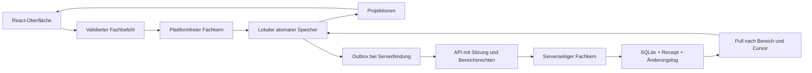

# Technische Architektur

## Komponenten und Zielstruktur

| Bereich | Verantwortung | Darf abhängen von |
|---|---|---|
| packages/domain | Geld, Datum, Regeln, Budget, Ausgleich; pure Validatoren und Änderungsberechnung | Plattformfreie Vertragstypen |
| packages/contracts | Validierte Ein-/Ausgaben, Fehlertypen und Versionen | Plattformfreie Schema-Bibliothek |
| packages/storage | Adapter, Transaktionen, Projektionen, Migrationen | domain, contracts |
| packages/sync | Outbox, Push/Pull, Revisionen, Konflikte | domain, contracts, Storage-Port |
| packages/importers | Dateiparser, Normalisierung, Vorschau, Dubletten | domain, contracts |
| packages/ui | Fachkomponenten, Plattformtokens, Eingabe- und Ansichtsmuster | domain/contract-Typen, React; injizierte Anwendungsdienste |
| apps/web | PWA, Browserrouting, Service Worker, IndexedDB-Komposition | gemeinsame Pakete |
| apps/desktop | Tauri-Hülle, gemeinsame React-App, Rust-Speicher-/Systembrücke | gemeinsame Pakete; begrenzte Tauri-Commands |
| apps/server | Fastify, Identitäten, Rechte, SQLite, Sync und statische PWA | domain, contracts, servergeeignete Speicherteile |

Keine UI-Abhängigkeiten im Fachkern; Contracts importieren nicht domain. Für Anwendungsorchestrierung verwenden die Apps gemeinsame Dienste aus storage/sync; UI erhält Ports über Composition Root. Keine zweite Fachimplementierung in Rust oder Serverrouten.

## Bibliotheken und Toolchain

pnpm-Workspace, TypeScript strict, React, Vite, Tauri 2, Fastify, Dexie, Zod für Verträge, Vitest für Fach-/Integrationsprüfungen, Playwright für Web-E2E. SQLite im Server mit einem gepflegten Node-Binding; Desktop über Rust/SQLite. In P1 kompatible stabile Versionen und eine unterstützte Node-LTS-Version festlegen und exakt sperren. Keine beta-Abhängigkeiten als Default.

Routing und UI-Zustand bleiben von persistenten Fachdaten getrennt. Kontolisten werden virtualisiert; große Imports und Berichtsprojektionen laufen im Web Worker. Lucide liefert Werkzeugicons, Systemschriften die Typografie. Native Funktionen werden über `PlatformServices` injiziert, nicht durch Plattformprüfungen in jedem Fachwidget.

## Speicherports

`StorageAdapter` bietet `readAggregate`, `query`, `applyAtomicBatch`, `loadConfirmed`, `loadPending`, `saveSyncPage`, `exportSnapshot`, `replaceSnapshot` und `rebuildProjections`. `applyAtomicBatch` prüft erwartete lokale Revisionen und schreibt Aggregate, Outbox und Projektionen gemeinsam. `saveSyncPage` schreibt alle Seitenänderungen samt Folgekursor in einer Transaktion.

IndexedDB und SQLite erfüllen dieselbe Contract-Suite. Die Desktopbrücke akzeptiert katalogisierte Batchtypen mit Schema-/Referenzprüfung; die UI erhält keinen unbeschränkten SQL- oder Dateisystemzugriff. Der Server führt jeden akzeptierten Fachbefehl, Receipt und Change in derselben SQLite-Transaktion aus.

## Datenfluss

Der Lokalbetrieb durchläuft denselben Fachkern, benötigt aber keine Outbox. Serverbestätigung kann Entwürfe bestätigen oder Konflikte erzeugen; sie überschreibt sie nicht still. Der UI-Erfolg eines Schreibvorgangs bedeutet dauerhafte lokale Speicherung, nicht bereits abgeschlossene Serversynchronisierung.

## Lokaler und verbundener Betrieb

Der Desktopstart benötigt keine Netzwerkverbindung. Die PWA cached ausschließlich versionierte App-Assets, niemals API-Antworten im Service Worker. Nach Erstladen ist sie offline startfähig. Persistenter Browserspeicher wird angefragt; Ablehnung oder Quota-Fehler werden sichtbar und verhindern keine Exporte bestehender Daten.

Ein lokales Profil besitzt einen privaten Bereich und beliebig viele Haushalte mit Teilnehmern. Das ist kein Mehrbenutzer-Sicherheitsmodell. Verbundene Profile werden nach Serverinstanz und User-ID getrennt; mehrere Browser-Tabs koordinieren Schreib-/Syncführung über Web Locks/BroadcastChannel. Logout löscht Sessionmaterial und sperrt die UI; lokale Daten bleiben auf ausdrücklichen Wunsch für erneute Anmeldung erhalten.

Ein lokaler Bereich wird über die API `spaces/from-snapshot` zu einem neuen Serverbereich. Der bereits bei Kontoanlage erzeugte leere eigene Privatbereich kann ausdrücklich als Initialbereich übernommen werden; enthält er bereits Finanzdaten, ist stattdessen bestätigter Restore mit Backup nötig. Haushaltsteilnehmer bleiben zunächst ungebundene Personen. Mitglieder werden später eingeladen und zugeordnet. Für jeden Bereich kann der Nutzer einen lokalen unabhängigen Export erzeugen; Serverbindung wird im Export nicht als gültige Zugangsbefugnis übernommen.

## Plattformintegration

Desktop verwendet originale Fensterdekoration, Systemmenüs, Dateiöffnen/-speichern, Betriebssystem-Schlüsselspeicher und bekannte Tastenkürzel. Native Datendialoge sind auf Web/PWA durch Browserdateiauswahl ersetzt. `PlatformServices` abstrahiert Dateiimport, Export, externe Links, Menübefehle, Datenpfad und sichere Tokenspeicherung.

Tauri lädt nur gebündelte Inhalte. Netzwerkanfragen gehen über eine begrenzte native Transportbrücke zur ausdrücklich konfigurierten HTTPS-Serverorigin; keine Tokens im React-Speicher persistieren. Bei localhost ist HTTP für Entwicklung zulässig. SQLite-Schreibbatch und Konsistenzprüfung erfolgen in Rust atomar; Fachberechnungen bleiben TypeScript.

## Skalierung und Kompatibilität

Eine Serverinstanz mit SQLite und lokalem dauerhaftem Volume ist v1-Betriebsmodell. Schreibzugriffe werden serialisiert, Leseseiten paginiert. Kein Cluster, kein Netzwerkdateisystem und keine externe Queue. SQL-Schema und finanzielle Snapshots werden durch Integrationstests mit 50.000 Buchungen geprüft.

Protokollversion 1 akzeptiert ausschließlich bekannte Befehle/Schemas; inkompatible Clients bekommen `UPDATE_REQUIRED`. Service-Worker-Updates werden angeboten, nicht während eines Imports oder Dialogs erzwungen. Vor Storage-Migration wird gesichert. Serverherabstufung erfolgt nur durch vollständige Wiederherstellung des passenden Backups.

## Quellen und Lizenz

Projektlizenz: AGPL-3.0-or-later. Fremdcode wird mit Herkunftscommit und ursprünglichem Hinweis dokumentiert. Fundamentale Architekturgrundlagen: [SQLite-Transaktionen](https://www.sqlite.org/lang_transaction.html), [Dexie](https://dexie.org/docs/Dexie/Dexie), [Tauri](https://v2.tauri.app/security/capabilities/), [Fastify-Validierung](https://fastify.dev/docs/latest/Reference/Validation-and-Serialization/).
